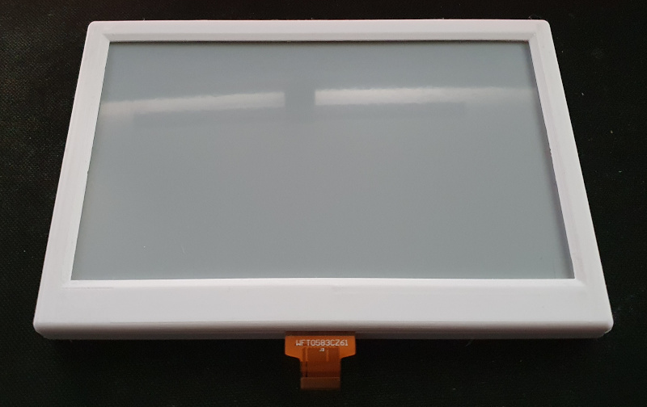
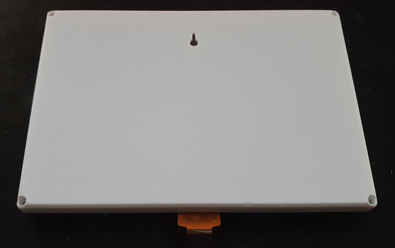
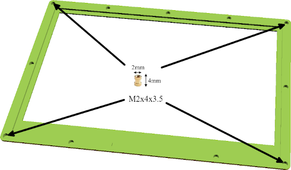
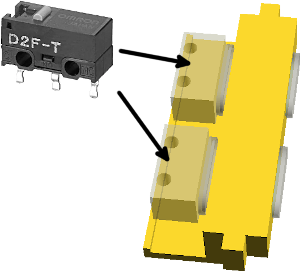

# OpenSCAD Screen Case

This is a OpenSCAD for screen case and specially the [e-ink Waveshare 7.5" screen](https://www.waveshare.com/product/displays/e-paper/7.5inch-e-paper.htm).

## Features

* Low profile
* Wall mounting system
* Openings to add modules such as buttons
* It is designed to be usable with other displays.

## Design

The case consists of 2 main parts, a front panel that will support the screen and a case that will contain the electronics.
The 2 parts fit together and are held together by 4 screws in the corners of the case.
The 4 M2 screws are screwed into M2x4x3.5 inserts (see picture).

### Gadgets

If you need to add things to the box, you can do so via gadgets that will be inserted into the box.

You can add a gadget with 2 buttons using 2 micro-switches Omron D2F-01F-T (see image below).

## Requirements

### Prints

You will only need to print 2 pieces and depending if you want buttons choose the associated gadgets.

* [case.stl](stl/case.stl)
* [front.st](stl/front.stl)
* Gadgets:
  * [gadget.stl](stl/gadget.stl) x4 if you do not want button
  * [gadget.stl](stl/gadget.stl) x3 and [gadget-button.stl](stl/gadget-button.stl) if you want one button gadget

### Pieces

* Insert M2X4X3.5 x4
* M2 x 5mm screws x2
* If you want to use button, you need switch (Omron D2F-01F-T)
